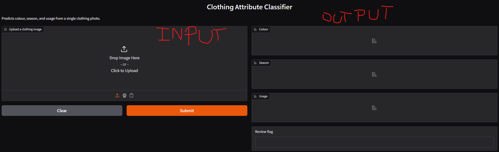
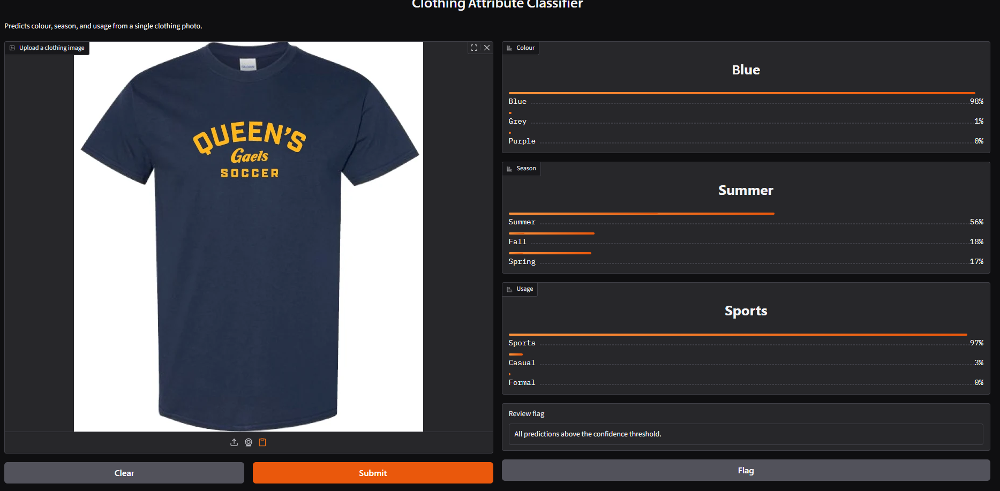
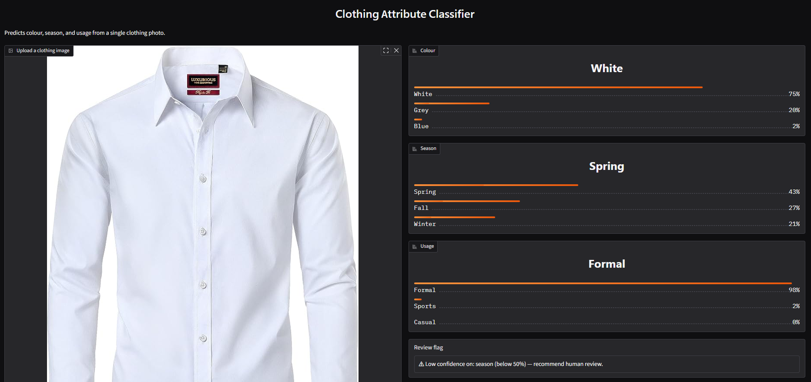
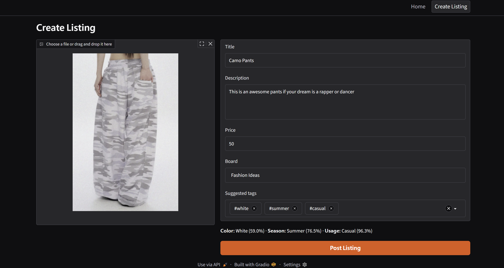

# CMPT 310 — Multi-Label Clothing Classification

Multi-label image classifier that predicts four clothing attributes (color, season, type, usage) using Transfer Learning (ResNet50).

---

## Stack

- **Language:** Python 3.10+
- **Deep Learning:** TensorFlow / Keras (ResNet50)
- **ML / Data:** scikit-learn, NumPy, pandas
- **Image processing:** Pillow
- **Visualization:** Matplotlib
- **Demo (Milestone 2):** Gradio
- **Dataset:** Kaggle CLI (`kaggle`)
- **Notebooks:** Jupyter

---

## Databases Used

1. **[Fashion Product Images (Small)](https://www.kaggle.com/datasets/paramaggarwal/fashion-product-images-small)** — main dataset. ~44,000 product images with color, season, and usage labels.
2. **[6000+ Store Items Images Classified By Color](https://www.kaggle.com/datasets/imoore/6000-store-items-images-classified-by-color)** — auxiliary dataset used to supplement our weakest colour classes.
3. **[Fashion LookMatch Dataset](https://huggingface.co/datasets/orianrivlin/fashion-lookmatch-dataset)** — auxiliary dataset used to supplement our weakest season/usage classes.

---

## Project Structure

```
CMPT310 Project/
├── data/                            ← gitignored, generated locally
│   ├── raw/                         ← downloaded Kaggle dataset (styles.csv, images/)
│   ├── external/
│   │   ├── color_ds/train/          ← auxiliary colour-labelled dataset (Kaggle, optional)
│   │   └── lookmatch_ds/            ← auxiliary season/usage dataset (HuggingFace, optional)
│   └── processed/                   ← cleaned CSVs, splits, and resized images (V2 pipeline)
│       ├── clean_apparel_v2.csv
│       ├── metadata_v2.csv
│       ├── images_96_v2/
│       ├── train_v2.csv
│       ├── val_v2.csv
│       ├── test_v2.csv
│       ├── color_aux_v1.csv         ← catalogued auxiliary colour data (optional)
│       └── style_aux_v1.csv         ← catalogued auxiliary season/usage data (optional)
├── experiments/                     ← recorded results from earlier tuning runs
│   ├── baseline/                    ← MobileNetV2, uncapped class weights
│   └── class_weight_cap_4/          ← MobileNetV2, class weight capped at 4.0
├── images_repo/                     ← screenshots used in this README
│   ├── gradio_app_example0.png      ← input/output layout
│   ├── gradio_app_example1.png      ← example prediction 1
│   └── gradio_app_example2.png      ← example prediction 2
├── models/                          ← gitignored, generated locally
│   ├── KNN/
│   │   └── knn_baseline.joblib      ← trained KNN model (generated by src/KNN/knn.py)
│   └── CNN/                         ← trained CNN model (Milestone 2)
├── notebooks/
│   └── 01_data_exploration.ipynb
├── reports/                         ← gitignored, generated by the scripts below
│   ├── confusion_baseColour.png / confusion_season.png / confusion_usage.png
│   ├── training_curves.png
|   ├── plots_image.png              ← train/loss graph
│   └── v2_color_mapping.csv / v2_conflicting_duplicates.csv / v2_unreadable_images.csv / v2_split_distributions.csv
├── src/
│   ├── data_loader.py               ← load CSV, check labels, filter & balance (shared)
│   ├── balance_clean_dataset.py     ← clean, dedupe, and consolidate colours in the raw dataset (shared)
│   ├── preprocess_split.py          ← resize images, create leakage-checked train/val/test splits (shared)
│   ├── KNN/
│   │   ├── knn.py                   ← train and save the KNN baseline model
│   │   └── predict_knn.py           ← run the trained KNN model on a single image
│   └── CNN/                         ← ResNet50 fine-tuning + Gradio demo (Milestone 2)
│       ├── train_cnn.py             ← trains the model (up to 4 phases)
│       ├── evaluate_cnn.py          ← test-set metrics + KNN comparison
│       ├── app_gradio.py            ← web demo
│       ├── prepare_color_aux_dataset.py  ← catalogs the optional auxiliary colour dataset
|       ├── prepare_style_aux_dataset.py  ← downloads + catalogs the optional auxiliary season/usage dataset
│       └── plots.py                 ← generating train/loss graph png file in reports/ folder
|        
├── testingimgs/                     ← local test images for predict_knn.py
├── requirements.txt
└── README.md
```

---

## Gradio Demo

Screenshots of `src/CNN/app_gradio.py` in action.

**Input/output layout:**



**Example 1** — a navy blue soccer jersey, correctly predicted as Blue / Summer / Sports, all above the confidence threshold:



**Example 2** — a white dress shirt, correctly predicted as White / Formal, but season confidence is low (Spring 43%), so the review flag triggers:



**Example 3** — Post Listing with suggested tags:



---

## Setup

### 1. Create a Virtual Environment

Open a PowerShell terminal in the project folder, then run:

```powershell
python -m venv venv
.\venv\Scripts\Activate.ps1
pip install -r requirements.txt
```

To leave the virtual enviroment
```powershell
deactivate
```

### 2. Set Up Kaggle Credentials

1. Go to [kaggle.com](https://www.kaggle.com) → your profile → **Account** → scroll to **API** → click **Create New Token**
2. This downloads a file called `kaggle.json`
3. Move it to: `C:\Users\<your-username>\.kaggle\kaggle.json`
If directory does not exist create it!

### 3. Download the Dataset

With the venv active, run:

```powershell
kaggle datasets download -d paramaggarwal/fashion-product-images-small -p data/raw --unzip
```

This places `styles.csv` and an `images/` folder inside `data/raw/`.

**Dataset:** [Fashion Product Images (Small)](https://www.kaggle.com/datasets/paramaggarwal/fashion-product-images-small) — ~44,000 product images at 80×60 px with rich metadata.

| Column in `styles.csv` | Label used |
|------------------------|------------|
| `baseColour`           | color      |
| `season`               | season     |
| `articleType`          | type       |
| `usage`                | usage      |

### 4. Preprocess and Split the Dataset (V2 pipeline)

After downloading the Kaggle dataset, clean it:

```bash
python src/balance_clean_dataset.py
```

This script:

- Loads `data/raw/styles.csv`, keeps `Apparel` items with valid `baseColour`, `season`, `usage`
- **Consolidates colour shades** into 12 canonical colours (e.g. `Navy Blue` / `Teal` → `Blue`) via a `COLOR_MAP`
- **Deduplicates by image content** (SHA256 hash), and drops images whose duplicates have contradictory labels
- No longer downsamples by usage — the full cleaned dataset is kept (no artificial balancing)
- Saves `data/processed/clean_apparel_v2.csv`, plus reports in `reports/` (`v2_color_mapping.csv`, `v2_conflicting_duplicates.csv`, `v2_unreadable_images.csv`)

Then split it:

```bash
python src/preprocess_split.py
```

This script:

- Resizes images to `96x96` (aspect-ratio-preserving padding) into `data/processed/images_96_v2/` — used by the KNN baseline
- Creates a **stratified 70/15/15 train/val/test split** on colour×season×usage, pooling rare combinations so no class is missing from any split
- **Validates zero data leakage** (no shared `id` or image hash across splits)
- Keeps both the KNN-ready 96×96 path (`image_path`) and the full-resolution path (`raw_image_path`, used by the CNN) in every row

Generated files:

```text
data/processed/metadata_v2.csv
data/processed/train_v2.csv
data/processed/val_v2.csv
data/processed/test_v2.csv
data/processed/images_96_v2/
```

Split ratio:

```text
70% train
15% validation
15% test
```

Each CSV contains:

```text
id
image_path        (96x96, KNN-ready)
raw_image_path     (full resolution, CNN-ready)
sha256
baseColour
originalColour     (pre-consolidation colour)
season
usage
productDisplayName
split
```

Note: The `data/` folder is ignored by GitHub, so each team member needs to download the Kaggle dataset and run both scripts locally.

### 5. Train the KNN Baseline

With the venv active and steps 3–4 above already run (`knn.py` needs `train_v2.csv`/`test_v2.csv`), run:

```powershell
python src/KNN/knn.py
```

`knn.py`:
- Trains on `data/processed/train_v2.csv`, evaluates on `data/processed/test_v2.csv` — the same split the CNN uses, so the KNN-vs-CNN comparison in `evaluate_cnn.py` is a fair one with zero row overlap between train and test
- Loads each image from the pre-resized 96×96 `image_path` column, flattens it, and encodes the `baseColour`, `season`, and `usage` labels
- Trains a `MultiOutputClassifier` wrapping `KNeighborsClassifier(k=5, weights="distance")`
- Prints exact-match accuracy plus per-label accuracy, weighted F1, and a classification report
- Saves the trained model to `models/KNN/knn_baseline.joblib`

#### About `knn_baseline.joblib`

A dictionary saved with `joblib.dump`, containing everything needed to reuse the trained model without retraining:

- `model` — the fitted `MultiOutputClassifier` (KNN) for `baseColour`, `season`, and `usage`
- `label_encoders` — a `LabelEncoder` per label, used to map predictions back to text
- `label_columns` — `["baseColour", "season", "usage"]`
- `image_size` — `(96, 96)`, the size images must be resized to before prediction

### 5.1 Use the train model

**Example: load the model and predict on a new image**
**Use the included script:** drop a test image into a `testingimgs/` folder in the project root, then run:

```powershell
python src/KNN/predict_knn.py testingimgs/your_image.jpg
```

This prints the predicted `baseColour`, `season`, and `usage` for that image.

### 6. Train and Evaluate the CNN (Milestone 2)

With the venv active and the dataset downloaded (steps 3–4 above), run these
scripts in order from the project root:

```powershell
python src/CNN/prepare_color_aux_dataset.py   # optional: catalog auxiliary colour data
python src/CNN/prepare_style_aux_dataset.py   # optional: fetch + catalog auxiliary season/usage data
python src/CNN/train_cnn.py                   # train the ResNet50 model
python src/CNN/evaluate_cnn.py                # evaluate on the test set + KNN comparison
python src/CNN/app_gradio.py                  # launch the web demo
```

`prepare_color_aux_dataset.py` (optional): downloads and catalogs an auxiliary colour-labelled dataset to help our weakest colour classes.
```powershell
kaggle datasets download -d imoore/6000-store-items-images-classified-by-color -p data/external/color_ds --unzip
python src/CNN/prepare_color_aux_dataset.py
```

`prepare_style_aux_dataset.py` (optional): fetches an auxiliary season/usage-labelled dataset from HuggingFace (no manual download needed) to help our weakest season/usage classes.

`train_cnn.py`: trains the ResNet50 model with three heads (`color`, `season`, `usage`) in up to four phases — two main training phases, plus two optional short "polish" phases if the auxiliary datasets above are present. Saves the trained model to `models/CNN/`.

`evaluate_cnn.py`: runs the trained model on the held-out test set, prints accuracy/F1/precision/recall per label, saves confusion matrices and training curves to `reports/`, and prints a KNN vs. CNN comparison table.

`app_gradio.py`: launches a local Gradio web page — upload a clothing photo, get back predicted color/season/usage with confidence scores.

### 6.1 GPU Training Setup (Optional, via WSL2)

Training the CNN on CPU works, but is slow. TensorFlow ≥ 2.11 **dropped native
GPU support on Windows** — the fix is running training inside **WSL2**
(Windows Subsystem for Linux), which gives full CUDA access to an NVIDIA GPU.
This section is optional; skip it if CPU training is fine for you.

**Requirements:** an NVIDIA GPU, and WSL2 with an Ubuntu distro installed.

#### Step 1 — Check WSL2 and GPU passthrough

Open **PowerShell**:

```powershell
wsl --status
wsl --list --verbose
```

If no distro is installed, run `wsl --install` (requires a restart). Then
open the Ubuntu shell and confirm the GPU is visible:

```powershell
wsl -d Ubuntu -- nvidia-smi
```

You should see your GPU listed. If this fails, update your Windows NVIDIA
driver — modern drivers include WSL2 GPU passthrough automatically, no
separate Linux driver install needed.

#### Step 2 — Open WSL2 and create a venv

```powershell
wsl -d Ubuntu
```

You can run the project either **directly against the Windows-mounted path**
(`/mnt/c/Users/<you>/Desktop/CMPT310 Project`, simplest, no copy) or from a
copy in WSL2's native filesystem (`~/CMPT310-Project`, faster disk I/O since
`/mnt/c` crosses a slow Windows↔Linux bridge for the many small image
files this project reads). Either works; the native copy is only worth the
one-time `rsync`/`cp` if training feels I/O-bound.

Either way, **create the venv itself on the native filesystem** — creating
one directly on `/mnt/c` can hang or take a very long time (`ensurepip`
writes hundreds of small files, which is exactly the slow case for that
bridge):

```bash
cd "/mnt/c/Users/<you>/Desktop/CMPT310 Project"   # or ~/CMPT310-Project if you copied it
python3 -m venv ~/venvs/cmpt310
source ~/venvs/cmpt310/bin/activate
python -m pip install --upgrade pip
pip install -r requirements.txt
pip install "tensorflow[and-cuda]"
```

`pip install` is fast here regardless of which directory you're standing in
— packages install into `~/venvs/cmpt310/lib/...` (native filesystem), not
into your current working directory.

#### Step 3 — Fix the CUDA library path

`tensorflow[and-cuda]`'s libraries won't be found by default — you'll see
`Cannot dlopen some GPU libraries` and `tf.config.list_physical_devices('GPU')`
will return `[]`. Fix it by adding both the WSL2 driver library and the
pip-installed CUDA/cuDNN libraries to `LD_LIBRARY_PATH`:

```bash
export LD_LIBRARY_PATH=/usr/lib/wsl/lib:$(find $(python3 -c "import sysconfig; print(sysconfig.get_path('purelib'))")/nvidia/*/lib/ -maxdepth 0 -type d -printf '%p:' 2>/dev/null)$LD_LIBRARY_PATH
```

**Make it permanent** so you don't retype it every session — append it to
the venv's own activation script (use a text editor like `nano` if pasting a
multi-line heredoc into your terminal is unreliable):

```bash
nano ~/venvs/cmpt310/bin/activate
```

Go to the end of the file and paste on its own line:

```
export LD_LIBRARY_PATH=/usr/lib/wsl/lib:$(find $(python3 -c "import sysconfig; print(sysconfig.get_path('purelib'))")/nvidia/*/lib/ -maxdepth 0 -type d -printf '%p:' 2>/dev/null)$LD_LIBRARY_PATH
```

Save (`Ctrl+O`, `Enter`) and exit (`Ctrl+X`). Verify it persists:

```bash
deactivate
source ~/venvs/cmpt310/bin/activate
echo $LD_LIBRARY_PATH
```

(If you re-source `activate` more than once in the same shell without
`deactivate` first, the path list duplicates — harmless, but `unset
LD_LIBRARY_PATH` before re-sourcing keeps it clean.)

#### Step 4 — Verify and train

```bash
python -c "import tensorflow as tf; print(tf.config.list_physical_devices('GPU'))"
```

Should print something like `[PhysicalDevice(name='/physical_device:GPU:0', device_type='GPU')]`.
Then run training as usual:

```bash
python src/CNN/train_cnn.py
```

To confirm the GPU is actually being used (not silently falling back to
CPU), watch utilization from a **second** terminal while training runs:

```powershell
wsl -d Ubuntu -- watch -n 1 nvidia-smi
```

(the `wsl` prefix belongs on the Windows/PowerShell side only — if you're
already inside the WSL2 shell, just run `nvidia-smi` directly, no prefix)

#### Cross-platform note

If your `train_v2.csv`/`val_v2.csv` were generated on Windows, their file
paths use backslashes (`data\raw\images\...`), which Linux treats as a
literal character rather than a directory separator. `train_cnn.py`/
`evaluate_cnn.py` already normalize this automatically (backslash → forward
slash) before reading any image, so no action needed — just noting it in
case you inspect the CSVs directly and see backslashes.

### 6.2 Generate Training Curves

Please follow the instructed steps before this stage. 
Training curves can be regenerated without retraining the model using `history.json`
(If you do not have 'history.json' please let us know, so that we can provide this file to you.)
#### Step 1 - Check whether the file exists
```text
models/CNN/history.json
```
#### Step 2 - Run the command below
```bash
python src/CNN/plots.py
```
#### Step 3 - Check this generates the plots
```text
reports/
├── plots_image.png
```
#### Plots


#### Step 4 - Evaluate the curves
- Compare the training and validation curves to check whether the model converged and whether there are signs of overfitting.
- Compare the performance of the color, season, and usage heads to determine which prediction task performs best.

#### Retraining the Model
If you retrain the CNN using `train_cnn.py`, a new `history.json`
will automatically be generated and can replace the existing one.


### 7. Explore the Data

Launch Jupyter and open the exploration notebook:

```powershell
jupyter notebook notebooks/01_data_exploration.ipynb
```

The notebook will:
- Confirm which of the four labels exist in the dataset
- Plot class distributions per label
- Show a sample grid of 9 clothing images

---
## Verify the Install

```powershell
python -c "import tensorflow, sklearn, PIL; print('All imports OK')"
```

---

## Milestone Summary

| Milestone | Goal |
|-----------|------|
| **1** | Data download, label inspection, preprocessing pipeline, KNN baseline skeleton |
| **2** | Fine-tune ResNet50, full evaluation (confusion matrices, training curves, KNN comparison), Gradio demo |
